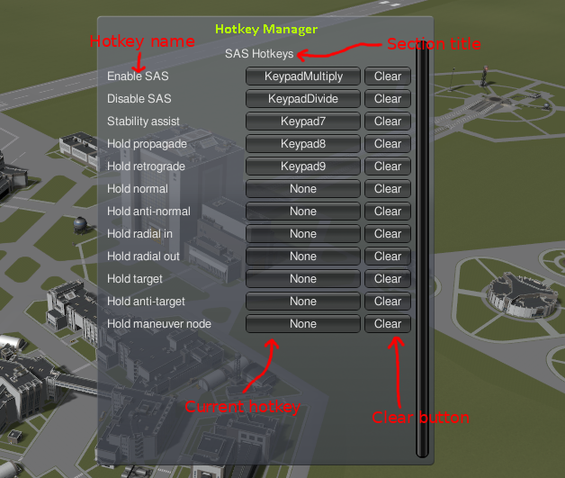

# Hotkey Manager

Kerbal Space Program mod that gives an API for creating custom hotkeys.

This mod provides a library for other mods to define custom hotkeys. It can be
used in two ways. In managed mode, everything is done automatically with
centralized configuration. In customized mode, everything can be customized.

**Note to modders:** If you decide to use Hotkey Manager in your mod, feel free
to send me a PR to include you in the list of users.

## Usage

If any hotkeys are configured through this mod, the Hotkey Manager icon appears on the toolbar at the space center:


Clicking on this icon displays the Hotkey Manager configuration dialog.
Clicking on it again, as well as leaving the scene, closes the dialog and
saves. The configuration window looks like this:



The section title is defined by the mod providing the hotkeys under the
section. Clicking on the current hotkey button allows you to define a new
hotkey by pressing that key (similarly to the stock hotkey settings). Pressing
the clear button clears the hotkey.

## Modding API

The API can be used in "managed mode", where the full functionality is provided
by the library, including the triggering and configuration. In practice, this
mode means using a global instance of the `HotkeyManager` class, and everything
else is done automatically.

The other mode is "customized mode", which means that each element of the
library is used in a customized way, and no global objects defined by the
library is used. Instead, the client mod uses each component however it likes.

### Managed Mode

This is the simplest way to use this mod. Just call the
`HotkeyManager.MainManager.Add()` method in your `Awake()` for each
functionality. The hotkey will be configurable from Hotkey Manager's main
configuration window that is accessible from the Space Center. The hotkeys are
active in flight mode and saved globally (across saves).

For example:

```csharp
[KSPAddon (KSPAddon.Startup.SpaceCentre, false)]
internal class MyMod : MonoBehaviour
{
    public void Awake()
    {
        HotkeyManager.HotkeyManager.MainManager.Add(
            "My mod",                // The name of the group.
            "My function",           // The name of the hotkey."
            new HotkeyAction(
                MyFunction,          // The function to call.
                true,                // false=level trigger, true=edge trigger.
                new KeyBinding()));  // Default key binding.
    }
    // ...
}
```

Mods known to use managed mode:
* [SAS Hotkeys](https://github.com/petersohn/SASHotkeys)

### Customized Mode

The hotkey manager functionality can be used directly by other mods. This
requires more coding, but allows wider usage scenarios. For example:
* Hotkeys outside flight mode.
* Per-game saving.
* Custom configuration.

Instead of using `HotkeyManager.MainManager`, instantiate your own
`HotkeyManager`. Then:
* Use `Add()` the same way as in managed mode.
* Call `Fire()` from `Update()` to check for pressed keys and call the trigger
  functions.
* Call `Save()` and `Load()` to save or load the hotkeys.

Instantiate `SettingsWindow` to create your own settings window. This will look
exactly the same as the one in managed mode, but it can use your own
`HotkeyManager` and can be triggered independently. Then:
* Call `Draw()` from `OnGUI()` to draw the settings window.

See [FlightBehaviour](FlightBehaviour.cs) and
[SpaceCentreBehaviour](SpaceCentreBehaviour.cs) for usage example.
